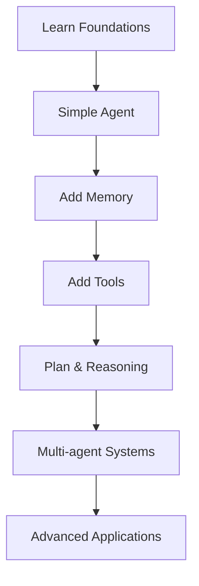

# 🤖 Agentic AI for Beginners

> *A comprehensive guide to understanding and building autonomous AI systems*


## 🌟 Introduction

Welcome to the world of Agentic AI! This repository aims to be your complete resource for learning about autonomous AI systems that can perform tasks with minimal human supervision.

### 🔍 What is Agentic AI?

Agentic AI refers to AI systems that can:

- 🎯 Operate autonomously to achieve goals
- 🤔 Make decisions based on context and objectives
- 🔄 Learn from interactions and feedback
- 🛠️ Use tools and APIs to accomplish tasks

## 📚 Learning Path

| Level | Topics | Projects |
|-------|--------|----------|
| **Beginner** | Foundations, LLMs, Basic Tools | Simple chatbot agent |
| **Intermediate** | Planning, Memory, Tool usage | Task automation agent |
| **Advanced** | Multi-agent systems, Evaluation | Complex workflow agent |

## 🧩 Core Components

### 1️⃣ Foundation Models

The building blocks of modern agentic systems:

- Large Language Models (LLMs)
- Multimodal Models
- Specialized Models

### 2️⃣ Reasoning & Planning

How agents think and plan:

- Chain-of-Thought (CoT)
- Tree of Thoughts (ToT)
- ReAct Prompting

### 3️⃣ Memory Systems

How agents remember information:

- Short-term context
- Long-term vector stores
- Structured memory

### 4️⃣ Tool Usage

How agents interact with the world:

- API Integration
- Code Execution
- Web Browsing

## 💻 Getting Started

```bash
# Clone this repository
git clone https://github.com/Yash-Kavaiya/Agentic-AI-for-Beginners.git

# Navigate to the repository
cd Agentic-AI-for-Beginners

# Install dependencies
pip install -r requirements.txt
```

## 🧪 Starter Projects

1. **Simple Task Agent**: Create a basic agent that completes simple tasks
2. **Research Assistant**: Build an agent that searches and summarizes information
3. **Personal Productivity Agent**: Develop an agent that helps with daily tasks

## 🔧 Frameworks & Tools

| Framework | Focus | Difficulty |
|-----------|-------|------------|
| LangChain | General agent development | ⭐⭐ |
| AutoGPT | Autonomous GPT agents | ⭐⭐⭐ |
| BabyAGI | Task management systems | ⭐⭐ |
| CrewAI | Multi-agent orchestration | ⭐⭐⭐ |

## 📘 Learning Resources

### 📖 Essential Reading

- [Building Agentic AI Systems](https://arxiv.org/abs/2310.10717)
- [Agents: A Practical Introduction](https://lilianweng.github.io/posts/2023-06-23-agent/)
- [The Rise and Potential of Large Language Model Based Agents](https://arxiv.org/abs/2309.07864)

### 🎓 Tutorials & Courses

- [LangChain: Chat with Your Data](https://www.deeplearning.ai/short-courses/langchain-chat-with-your-data/)
- [Building Systems with the ChatGPT API](https://www.deeplearning.ai/short-courses/building-systems-with-chatgpt/)
- [Agents for Everyone](https://huggingface.co/learn/agents/introduction)

## 📊 Project Roadmap



## 👥 Community & Support

- 💬 [Join our Discord](https://discord.gg/agentic-ai-community)
- 📝 [Submit an Issue](https://github.com/Yash-Kavaiya/Agentic-AI-for-Beginners/issues)
- 🌐 [Follow us on Twitter](https://twitter.com/AgenticAI)

## 🤝 Contributing

Contributions make the open source community amazing! Any contributions you make are **greatly appreciated**.

1. Fork the Project
2. Create your Feature Branch (`git checkout -b feature/AmazingFeature`)
3. Commit your Changes (`git commit -m 'Add some AmazingFeature'`)
4. Push to the Branch (`git push origin feature/AmazingFeature`)
5. Open a Pull Request

## 📄 License

Distributed under the MIT License. See `LICENSE` for more information.

---

⭐ **Star this repository if you found it helpful!** ⭐
